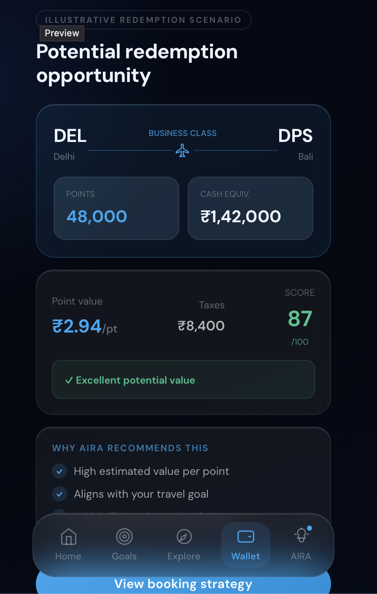

#  AI Travel Rewards Assistant

### AI-powered product concept for turning fragmented credit card rewards into personalized, explainable travel decisions.

> **From scattered reward points → to smarter travel redemption decisions.**

---

##  My Role

**Product Manager**

I owned the end-to-end product thinking for this independent AI product case study.

**Areas covered:**

- Product Discovery & Problem Framing
- User Research
- Product Strategy & Prioritization
- Personas & Jobs-to-be-Done
- PRD & User Stories
- UX Flow & Product Experience
- AI Product Design
- AI Evaluation Framework
- Metrics & KPI Framework
- Product Roadmap & GTM
- UX Prototype

---

##  The Problem

Travel reward points are often scattered across multiple credit cards, banks, airlines and hotel loyalty programs.

Users struggle to answer questions such as:

- Which card should I use?
- What are my points actually worth?
- Should I transfer points to an airline or hotel partner?
- What is the best redemption option for my trip?
- Do I have enough points for my desired redemption?

### The opportunity

Move users from:

**Information discovery → Personalized decision-making**

---

## 💡 The Solution

An **AI Travel Rewards Assistant** that understands:

- User reward balances
- Credit card portfolio
- Travel goals
- Destination and dates
- Redemption preferences
- Value optimization criteria

The product then analyzes available redemption paths and recommends the best option.

### Product Flow

**User Goal → AI Analysis → Redemption Options → Best Recommendation**

---

## Key Features

### 💳 Unified Rewards View
Bring fragmented reward balances into one place.

###  Travel Goals
Users can define destinations, travel preferences and redemption goals.

### AI Recommendations
Compare multiple redemption paths and recommend the most valuable option.

### Point-Value Comparison
Help users understand the real value of their rewards across different redemption options.

### Explainable AI
Show users *why* a recommendation was selected instead of providing a black-box answer.

###  Future: Proactive Alerts
Notify users when a valuable redemption opportunity becomes available.

---

#  AI Product Thinking

The AI layer is designed to:

1. Understand the user's travel intent
2. Retrieve relevant rewards information
3. Identify possible redemption paths
4. Compare available options
5. Rank recommendations based on user preferences and value
6. Explain the recommendation

### Key AI Risks

The product considers risks such as:

- Hallucinated reward information
- Outdated partner or redemption data
- Incorrect point valuations
- Poor recommendation ranking
- Lack of explainability

These risks are addressed through **evaluation criteria, data freshness requirements and product guardrails.**

---

# Success Metrics

## North Star Metric

### Successful Reward Optimization

**Percentage of active users who complete a redemption using a product recommendation.**

### Supporting Metrics

- Travel goals created
- AI recommendations viewed
- Recommendation → redemption conversion
- Recommendation accuracy
- User satisfaction
- 30-day retention

---

# Product Roadmap

### Phase 1 — MVP

- User onboarding
- Reward balance input
- Travel goal creation
- Basic redemption recommendations

### Phase 2 — Personalization

- Card portfolio integration
- Real-time rewards data
- Personalized recommendations
- Redemption alerts

### Phase 3 — AI Travel Assistant

- Proactive travel planning
- Predictive reward opportunities
- AI-powered travel concierge

---

# 📂 Explore the Product Case Study

The complete product journey is structured into **11 stages**.

## 01 — Discovery

### [01. Problem Discovery](./01-problem-discovery.md)
Understand the core user problem and opportunity.

### [02. User Research](./02-user-research.md)
Research user needs, behaviors, pain points and decision-making patterns.

---

## 02 — Product Strategy

### [03. Product Strategy](./03-product-strategy.md)
Define the product vision, strategy and prioritization approach.

### [04. Personas & JTBD](./04-personas-and-jtbd.md)
Translate user needs into personas and Jobs-to-be-Done.

### [05. PRD & User Stories](./05-prd-and-user-stories.md)
Convert product requirements into actionable user stories and product requirements.

---

## 03 — Product Experience

### [06. UX Flow](./06-ux-flow.md)
Map the end-to-end product experience and user journey.

### [11. UX Prototype](./11-prototype.md)
Explore the product concept through the interactive prototype.

---

## 04 — AI Product Thinking

### [07. AI Product Design](./07-ai-product-design.md)
Define where AI creates value within the product experience.

### [08. AI Evaluation Framework](./08-ai-evaluation-framework.md)
Define how AI recommendation quality, accuracy and reliability can be evaluated.

---

## 05 — Product Strategy & Execution

### [09. Metrics & KPIs](./09-metrics-and-kpis.md)
Define the North Star Metric and supporting product metrics.

### [10. Roadmap & GTM](./10-roadmap-and-gtm.md)
Define product evolution, prioritization and go-to-market thinking.

---

# Product Prototype

### Explore the Figma prototype

The prototype demonstrates the proposed user journey from:

**Travel Goal → Rewards Overview → AI Analysis → Redemption Recommendation**

Figma prototype- https://www.figma.com/make/HYUKyNkzsbJQrq1m5j9tsk/Design-Glassmorphism-UI?code-node-id=0-6&t=qwyF4ufsASTkZury-0&fullscreen=1

*Replace the # above with your Figma prototype URL.*

---

# Product Screens

### Travel Goal

### Rewards Overview

### Rewards Health Check

### Redemption Recommendation

### Points Transfer Planning

---

#  Product Artifacts

This case study includes:

- Problem Discovery
- User Research
- Product Strategy
- Personas & JTBD
- PRD & User Stories
- UX Flow
- AI Product Design
- AI Evaluation Framework
- Metrics & KPIs
- Product Roadmap & GTM
- UX Prototype

---

## 🔗 Quick Navigation

| Stage | Artifact |
|---|---|
| 01 | [Problem Discovery](./01-problem-discovery.md) |
| 02 | [User Research](./02-user-research.md) |
| 03 | [Product Strategy](./03-product-strategy.md) |
| 04 | [Personas & JTBD](./04-personas-and-jtbd.md) |
| 05 | [PRD & User Stories](./05-prd-and-user-stories.md) |
| 06 | [UX Flow](./06-ux-flow.md) |
| 07 | [AI Product Design](./07-ai-product-design.md) |
| 08 | [AI Evaluation Framework](./08-ai-evaluation-framework.md) |
| 09 | [Metrics & KPIs](./09-metrics-and-kpis.md) |
| 10 | [Roadmap & GTM](./10-roadmap-and-gtm.md) |
| 11 | [UX Prototype](./11-prototype.md) |

---

## About This Case Study

This is an **independent Product Management case study** created to demonstrate:

**Product Discovery • Product Strategy • AI Product Thinking • UX • Metrics • Execution**

The concept focuses on how AI can transform a complex rewards ecosystem into a simpler, more personalized decision-making experience.

---

**Built as a Product Management portfolio project by Arpita Saraswat.**
